# Understanding and Improving Representation Learning in the Presence of Shortcuts
---
[](https://github.com/batu-el/understanding-shortcuts/blob/main/paper.pdf)
[](https://github.com/batu-el/understanding-shortcuts/blob/main/presentation.pdf)
---

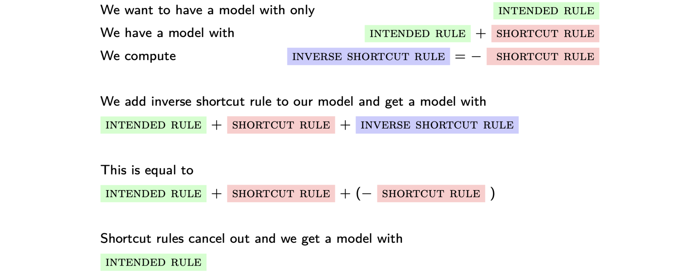
## Abstract 
Shortcuts are decision rules that exploit spurious correlations between the input attributes and labels that hold for the majority of the training examples. Consequently, they lead to worse performance on minority data groups where the spurious correlations do not hold. Models fine-tuned with Empirical Risk Minimization (ERM) have been observed to struggle with predictions on out-of-distribution (OOD) test sets, where the proportion of data groups differs from the one seen by the model during training, due to the model's reliance on shortcuts. In response, previous research has proposed various modifications to the loss function to re-weight the contribution of training examples; however, the effect of these modifications on the models' internal representations and decision-making processes is not well understood. In this thesis, we develop Competing Rules Hypothesis (CRH), which describes the model's decision-making process as a competition between an intended rule and a shortcut rule, as a framework to understand how models implement simple shortcuts. Building on CRH, we propose Representation Shift (reprshift), which surgically modifies a single layer inside the network to systematically shift the representations of examples with shortcuts, as an interpretability-based approach to shortcut mitigation. 

Our experiments are divided into two parts. In the first part, we inspect the internal representations learned by models fine-tuned with ERM and four existing loss function-based shortcut mitigation methods. Using natural language inference (MultiNLI) and toxicity detection (CivilComments) datasets, we (1) compare the representations learned by different loss functions using Centered Kernel Alignment (CKA), (2) probe the representations for information about the shortcut attributes, and (3) investigate how the classifier layers use the information from the earlier layer representations to make predictions. In the second part, we conduct causal intervention experiments to understand how an ERM-trained model implements a shortcut rule and find suggestive evidence for CRH. Finally, we demonstrate that reprshift can be used to substantially improve worst-group performance on MultiNLI.

*We recommend reading the introduction section from the paper, which provides a comprehensive summary of our work.*

# Codebase Overview

## Directory Structure

### `notebooks/`

This folder contains Jupyter notebooks used for experiments. These notebooks are categorized into three main types:

1. **Data Notebooks**: Used for dataset inspection and exploration.
2. **Training Notebooks**: Contain scripts for training our models.
3. **Analysis Notebooks**: Used to run experiments and analyze results.

All experiments were conducted using GPUs accessed via Google Colab.

### `reprshift/`

This folder contains the core codebase for our models, largely derived from the SubpopBench repository, adapted and extended to fit our specific experiments:

- **Source**: SubpopBench repository ([https://github.com/YyzHarry/SubpopBench](https://github.com/YyzHarry/SubpopBench))
- **Contents**:
  - Implementations of loss function-based methods.
  - Evaluation pipeline for models.

### `transformerlens_2/`

This folder includes a customized version of the Transformer Lens library:

- **Original Library**: Transformer Lens ([https://github.com/TransformerLensOrg/TransformerLens](https://github.com/TransformerLensOrg/TransformerLens))
- **Modifications**:
  - Adapted the HookedEncoder from a Masked Language Model (MLM) to a Classification model.
  - Adjusted the MLM head structure to facilitate our experiments.

### Additional Resources

- **CKA Experiments**: For experiments involving CKA (Centered Kernel Alignment), we use code from the following repository: [https://github.com/jayroxis/CKA-similarity/tree/main](https://github.com/jayroxis/CKA-similarity/tree/main).

---

# Background
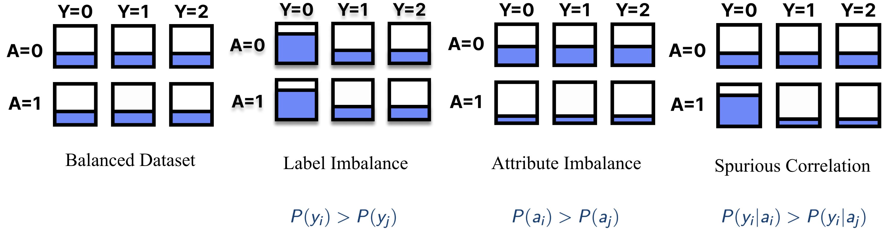
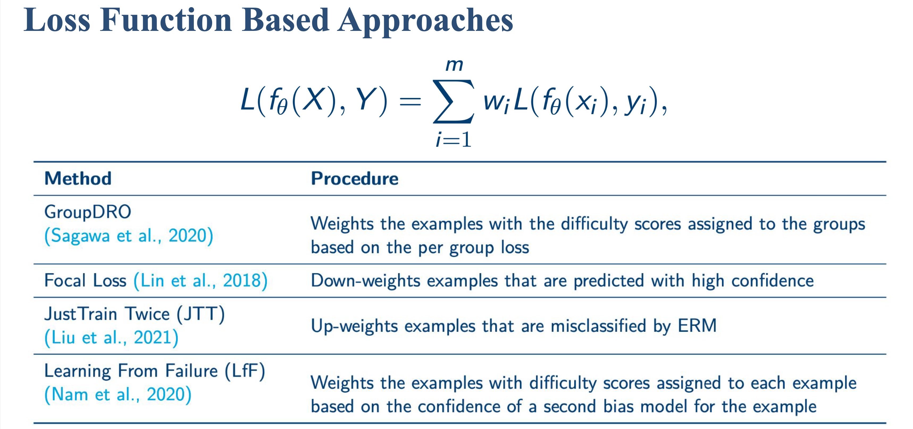
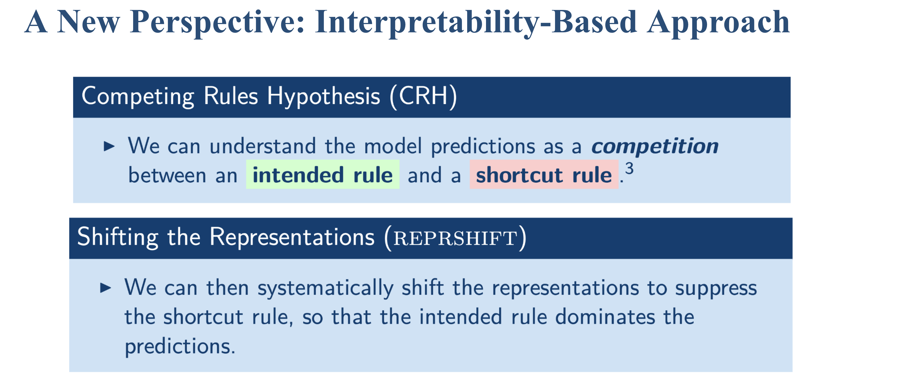

---

# Competing Rules Hypothesis
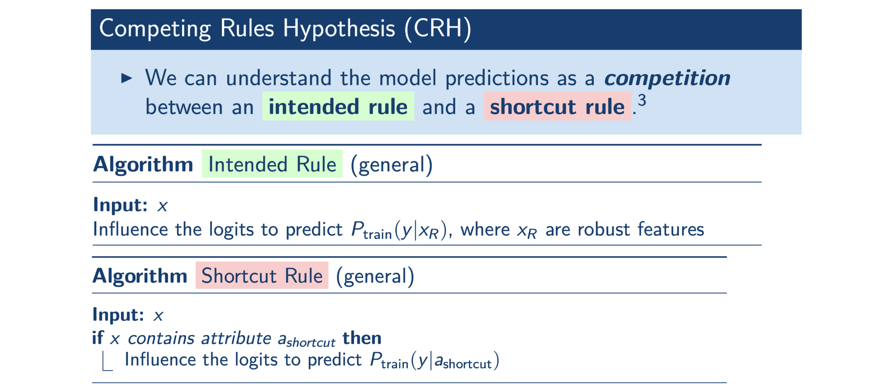
### Empirical Evidence A. Constructive Interference
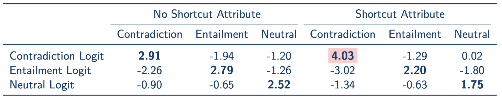
### Empirical Evidence B. Destructive Interference
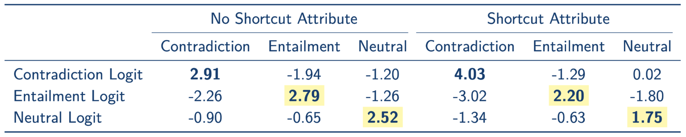
### Empirical Evidence C. Narrow Channels
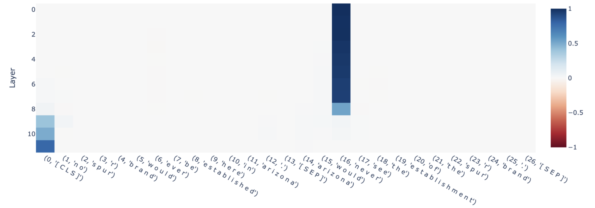

---

# Representation Shift
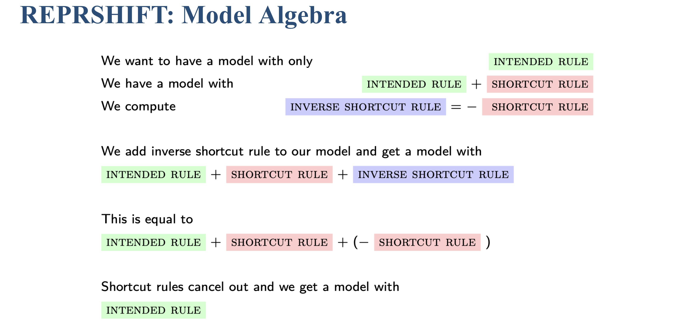
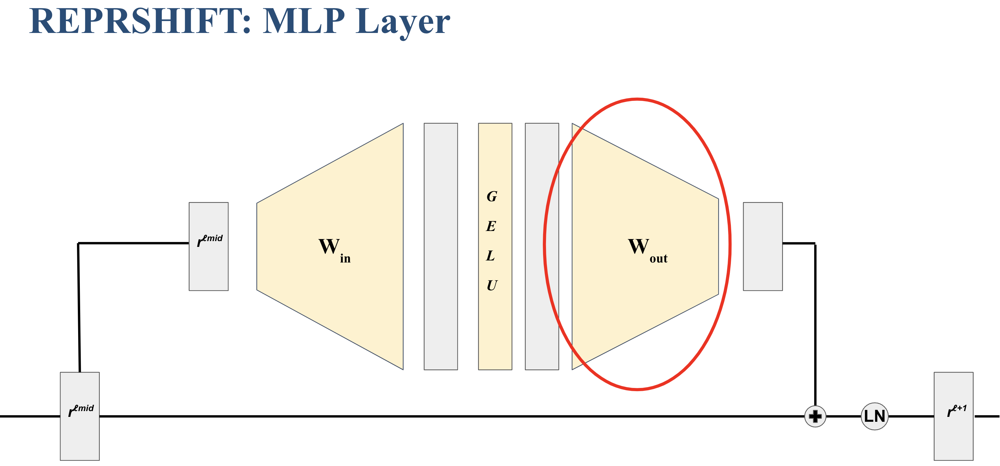
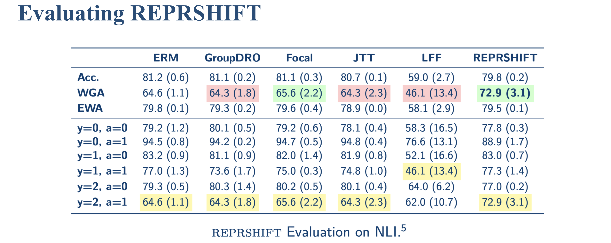

---

# Inspecting Representations
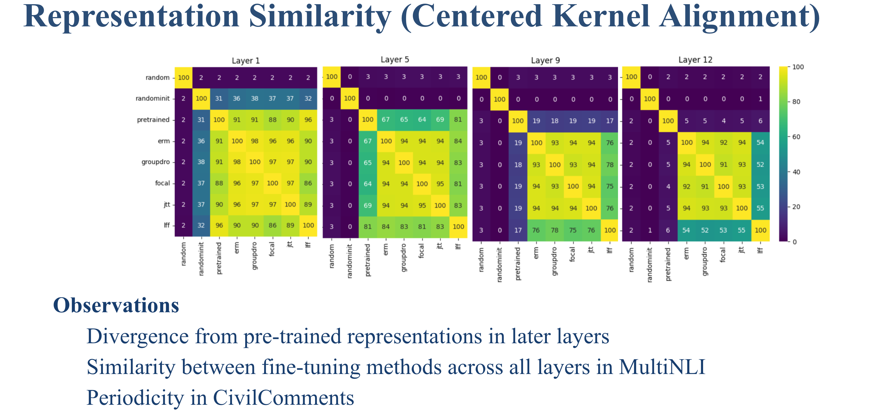
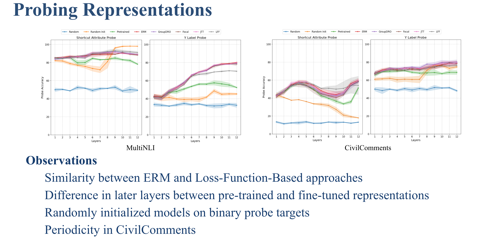
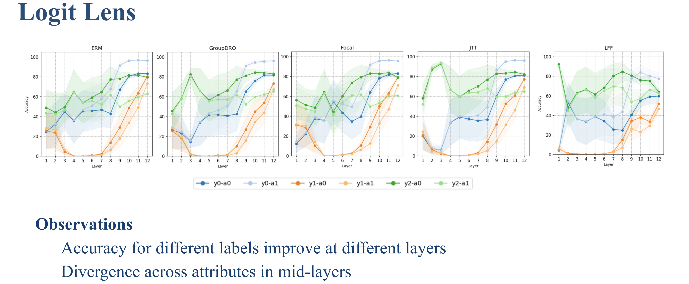

---

# Training Dynamics
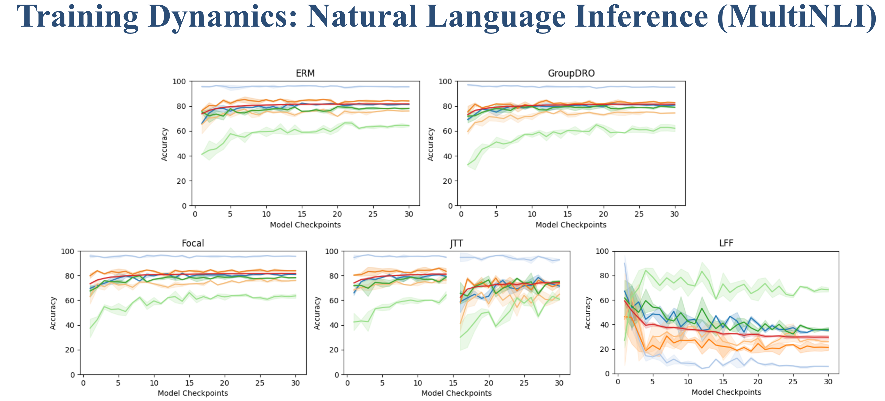
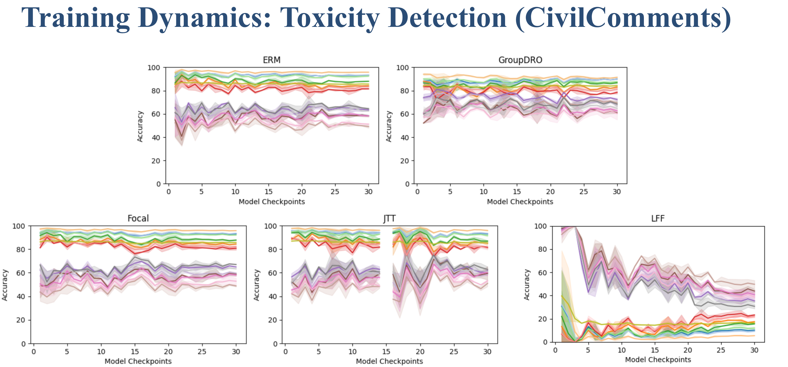

---

# Citation

```bibtex
@article{elunderstandingshortcuts,
    title={Understanding and Improving Representation Learning in the Presence of Shortcuts},
    author={El, Batu},
    journal={MPhil Thesis, University of Cambridge},
    year={2024}
}
```
---
